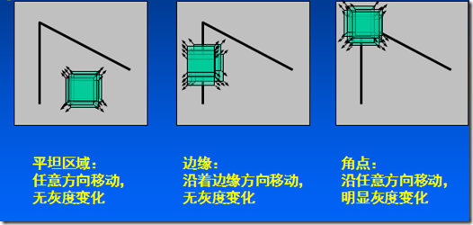
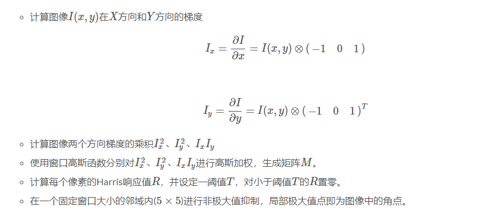
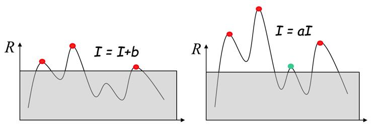

## 角点检测算法

角点检测也称为特征点检测，是图像处理和计算机视觉中用来获取图像局部特征点的一类方法，广泛应用于运动检测、图像匹配、视频跟踪、三维建模以及目标识别等领域中。

代码可参考：[角点检测实现](../python/ImagePointsDetection/)

### Harris角点检测

Harris是基于角点的特征描述子，属于feature detector，主要用于图像特征点的匹配(match)，在SIFT算法中就有用到此类角点特征。角点满足局部特征的一些特性：

- 可重复性：同一个特征可以出现在不同的图像中
- 独特性：特征在某一特征目标上表现为独特性，能够与场景中其他物体相区分，能都达到后续匹配或识别的目的。
- 局部性：特征能够刻画图像的局部特性，而且对环境影响因子鲁棒
- 紧致性和有效性：能够有效地表达信息，而且在实际应用中运算要尽可能地快

#### 角点检测

特征点在图像中一般有具体的坐标，并具有某些数学特征，如局部最大或最小灰度、以及某些梯度特征等。角点可以简单的认为是两条边的交点，比较严格的定义则是在邻域内具有两个主方向的特征点，也就是说在两个方向上灰度变化剧烈。如下图所示，在各个方向上移动小窗口，如果在所有方向上移动，窗口内灰度都发生变化，则认为是角点；如果任何方向都不变化，则是均匀区域；如果灰度只在一个方向上变化，则可能是图像边缘。

简单而言，角点具有如下特征：
- 轮廓之间的交点
- 对于同一场景，及时视角发生变化，通常具备稳定性质的特征
- 该点父级区域的像素点无论在特度方向上还是其特度幅值上有着较大变化

#### 算法原理与实现

Harris角点检测的基本思想是使用一个固定大小的滑动窗口在图像上进行任意方向上的滑动，然后比较滑动前和滑动后的窗口中的像素灰度变化程度。如果存在任意方向上的滑动都有着较大的灰度变化，则可认为窗口中存在角点。

Haris角点具有以下性质：

1. 参数$\alpha$对角点检测的影响：增大$\alpha$的值，将减少角点响应值$R$，减少被检测角点的数量；减少$\alpha$的值，将增大角点响应值$R$，增加被检测角点的数量。
2. Haris角点检测对亮度和对比度的变化不敏感

3. Harris角点检测具有旋转不变性，但不具备尺度不变性。

#### 参考

1. [图像特征之Harris角点检测](https://senitco.github.io/2017/06/18/image-feature-harris/)
2. [Code: Harris Detector](https://github.com/ronnyyoung/ImageFeatures)
3. [Harris角点](https://www.cnblogs.com/ronny/p/4009425.html)
4. [尺度空间理论](https://www.cnblogs.com/ronny/p/3886013.html)
5. [局部特征(2)——Harris角点](https://blog.csdn.net/jwh_bupt/article/details/7628665)

