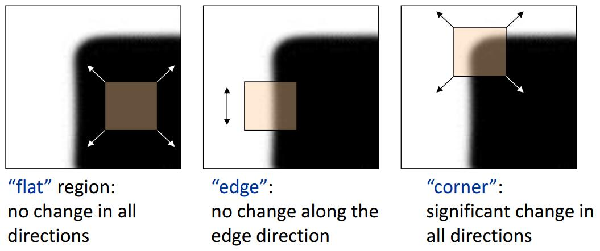

## 角点检测算法

角点检测也称为特征点检测，是图像处理和计算机视觉中用来获取图像局部特征点的一类方法，广泛应用于运动检测、图像匹配、视频跟踪、三维建模以及目标识别等领域中。在本篇文章中，介绍角点检测算法的流程，从应用Harris角点检测算法，然后使用susan伪角点进行ncc匹配，最后通过ransac算法进行提纯，从而得到一个具有鲁棒性的角点检测流程。

代码可参考：[角点检测实现](../python/ImagePointsDetection/)

### Harris角点检测

Harris是基于角点的特征描述子，属于feature detector，主要用于图像特征点的匹配(match)，在SIFT算法中就有用到此类角点特征。角点满足局部特征的一些特性：

- 可重复性：同一个特征可以出现在不同的图像中
- 独特性：特征在某一特征目标上表现为独特性，能够与场景中其他物体相区分，能都达到后续匹配或识别的目的。
- 局部性：特征能够刻画图像的局部特性，而且对环境影响因子鲁棒
- 紧致性和有效性：能够有效地表达信息，而且在实际应用中运算要尽可能地快

#### 角点检测

特征点在图像中一般有具体的坐标，并具有某些数学特征，如局部最大或最小灰度、以及某些梯度特征等。角点可以简单的认为是两条边的交点，比较严格的定义则是在邻域内具有两个主方向的特征点，也就是说在两个方向上灰度变化剧烈。如下图所示，在各个方向上移动小窗口，如果在所有方向上移动，窗口内灰度都发生变化，则认为是角点；如果任何方向都不变化，则是均匀区域；如果灰度只在一个方向上变化，则可能是图像边缘。

简单而言，角点具有如下特征：
- 轮廓之间的交点
- 对于同一场景，及时视角发生变化，通常具备稳定性质的特征
- 该点父级区域的像素点无论在特度方向上还是其特度幅值上有着较大变化

#### 算法原理与实现

Harris角点检测的基本思想是使用一个固定大小的滑动窗口在图像上进行任意方向上的滑动，然后比较滑动前和滑动后的窗口中的像素灰度变化程度。如果存在任意方向上的滑动都有着较大的灰度变化，则可认为窗口中存在角点。

Haris角点具有以下性质：

1. 参数$\alpha$对角点检测的影响：增大$\alpha$的值，将减少角点响应值$R$，减少被检测角点的数量；减少$\alpha$的值，将增大角点响应值$R$，增加被检测角点的数量。
2. Haris角点检测对亮度和对比度的变化不敏感

3. Harris角点检测具有旋转不变性，但不具备尺度不变性。

### SUSAN算法

SUSAN(Small univalue segment assimilation nucleus)算子是一种基于灰度的特征点获取方法，适用于图像中边缘和角点的检测，可以去除图像中的噪声，具有简单、有效、抗噪声能力强，计算速度快的特点。

与其他边缘和角点检测算子相比，SUSAN算子具有独特之处：
- 在用SUSAN算子对边缘和角点进行检测时不需要计算微分，对噪声更加鲁棒
- SUSAN检测算子能提供不依赖于模板尺寸的边缘精度。换言之最小的SUSAN区域面积的计算是个相对的概念，与模板尺寸无关。
- 控制参数的选择简单，且任意性小，容易实现自动化选取。

#### 原理概述

SUSAN算子采用一种近似圆形的滑动窗口模板，领域窗口内的每个像素点的灰度值和中心像素作比较，若两者的灰度差值小于一定阈值，则认为该像素点与中心像素具有相似的灰度值，满足这一条件的像素组成的区域称为吸收核同值区。

#### 算法步骤

1. 定义一个半径为$r$（$r=3$）的圆形滑动模板，比较模板内像素与中心像素的灰度值差异，构成USAN区域。公式如下：

式中，$r_0$表示该模板核在图像中位置，$r$则是模板内其他像素的位置，$I(r)$表示图像灰度值。

2. 计算USAN区域面积

3. 计算角点响应值

阈值可取$g = \frac{n_{max}}{2}$，$USAN$面积达到最小时，角点响应值达到最大。

4. 在领域内对角点响应值做非极大值抑制。

### NCC匹配

NCC（normalized cross correlation）算法，归一化互相关匹配法，是基于图像灰度信息的匹配方法。是用来比较两幅图像的相似程度已经是一个常见的图像处理手段。图像匹配的方法主要有三种：基于灰度，基于特征，基于变换域。

NCC算法可以有效降低光照对图像比较结果的影响。而且NCC最终结果在0到1之间，所以特别容易量化比较结果，只要给出一个阈值就可以判断结果的好与坏。传统的NCC比较方法比较耗时，虽然可以通过调整窗口大小和每次检测的步长矩形部分优化，但是对工业生产检测然后不能达到实时需求，通过积分图像实现预计算，比较模板图像与生产出电子版之间的细微差异，可以帮助企业提高产品质量，减少次品出厂率，把控质量。

### RANSAC算法

RANSAC为Random Sample Consensus的缩写，它是根据一组包含异常数据的样本数据集，计算出数据的数学模型参数，得到有效样本数据的算法。

RANSAC算法的基本假设是样本中包含正确数据，也包含异常数据，即舒局长含有噪声，这些异常数据可能由于错误的测量、错误的假设、错误的计算等产生的。同时RANSAC也假设，给定一组正确的数据，存在可以计算出符合这些数据的模型参数的方法。

### 参考

1. [图像特征之Harris角点检测](https://senitco.github.io/2017/06/18/image-feature-harris/)
2. [Code: Harris Detector](https://github.com/ronnyyoung/ImageFeatures)
3. [Harris角点](https://www.cnblogs.com/ronny/p/4009425.html)
4. [尺度空间理论](https://www.cnblogs.com/ronny/p/3886013.html)
5. [局部特征(2)——Harris角点](https://blog.csdn.net/jwh_bupt/article/details/7628665)

